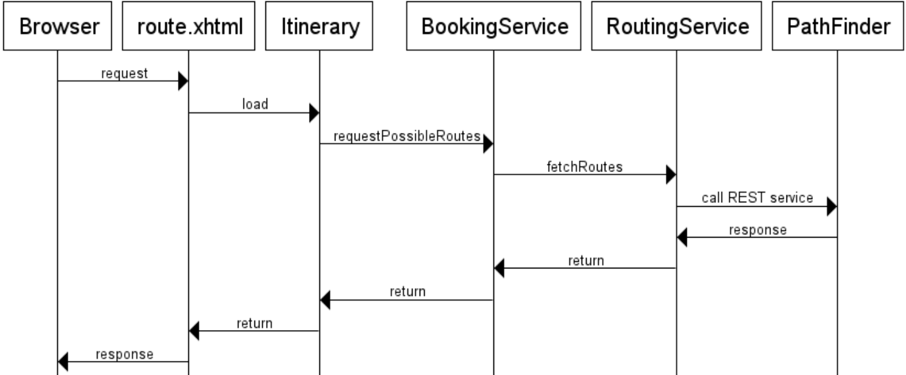
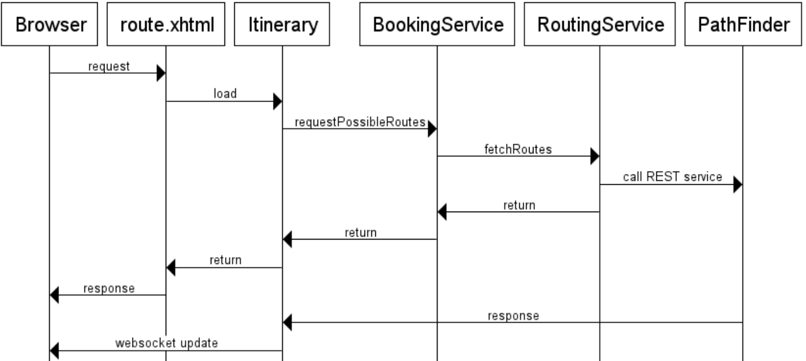
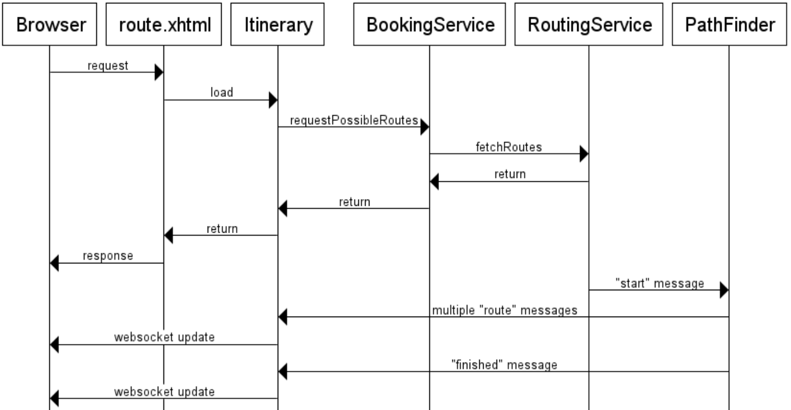

== Part 1: Introduce reactive behavior in the monolith

Let's start the exercises with the initial project in the Work Project. You can find the initial project also on the `master` branch of the Example project if you want to compare it with subsequent stages of the Example project.

The overview of the application components we will work with and they interact in the initial version with a traditional design:

=== 1. Enhance reactive REST client

**Tasks:**

* modify `ExternalRoutingService` to use reactive JAX-RS client API to access the remote `graphTraversalResource` service
* use the method `rx()` to turn the synchronous `Invocation.Builder` into a `RxInvoker`
* refactor the call to `get()` method on `Invocation.Builder` to call the service with the `get()` mthod on the `RxInvoker` instead

NOTE: You may use an instance of `GenericType` as an argument to define the type to convert the response to. Otherwise the type will be `Response` and it needs to be converted to the correct type in the handler

The new `get()` method returns `CompletionStage`, which we can return immediately or chain handlers before we return it to upper levels.

At this stage we're not going to change the  definition of `fetchRoutesForSpecification` method, therefore we add a handler to the CompletionStage, wait for the stage to complete and return data as before.

Check the branch `01_jee8_async_api_01_jaxrs_client` in the Example Project for an example solution.

=== 2. Refactor method defition to cascade reactive calls

We now need to return the `CompletionStage` so that the modified method `fetchRoutesForSpecification` doesn't have to wait for getting the results from a remote call.

**Tasks:**

* change return type of `fetchRoutesForSpecification` to CompletionStage instead of List
* refactor all broken code so that `DefaultBookingService` receives a `CompletionStage`
* in `DefaultBookingService`, wait for the future to finish and return its result in the same way as we did in `ExternalRoutingService` before
* we need to repeat this for all components on the upper level

Check the branch `02_jee8_chaining_01_completablefuture` in the Example Project for an example solution.

=== 3. Introduce Web Sockets to update UI asynchronously

In this step, we complete the asynchronous chain up to the view bean. In the UI level, we turn CompletionStage into an update over a WebSocket.

This step requires a lot of tedious refactoring and boiler-plate code therefore you are encouraged to copy the solution from the branch `03_jee8_messages_01_websocket` in the Example Project.

The refactoring involves:

* propagating `CompletionStage` up to the `ItinerarySelection`
* change the page so that it accepts empty data
* initiate a WebSocket connection from the page
* send an event to update data on the page when the `CompletionStage` is completed

The current design:

=== 4. Introduce streaming

We've improved responsiveness a bit but the data are still displayed after all the data is available. We can improve it so that the page is immediately updated with partial results as soon as they are available. 

Because REST protocol is limited to waiting for whole response, we'll refactor `GraphTraversalService` to use CDI events instead. We'll use CDI events to send both the request to the `GraphTraversalService` and also to send back pieces of the response from the service.

To speed up this exercise, you can start from the code in the branch `03_jee8_initial_messages_02_event_bus`, which already contains:

* dependency to RxJava, which provides a reactive API to simplify work with streams of data (dataflow)
* `GraphTraversalResource` - wraps sending and receiving CDI events on the client side. Needs to keep track of all the requests and match events to the corresponding requests (to their event emitters)
* `GraphTraversalRequest` and `GraphTraversalResponse` event types
* `route.xhtml` was modified to expect "error" message, "finished" message. Any other message will trigger update of the datatable

**Tasks**:

* modify `ExternalRoutingService` to use `GraphTraversalResource` to invoke the remote service instead of the REST client API
* modify the chain of invocations from `ExternalRoutingService` to `ItinerarySelection` so that `Flowable` is passed and `ItinerarySelection` finally adds handlers to it (doOnNext, doOnError, odOnComplete)
* call `subscribe()` on the `Flowable` in `ItinerarySelection` to trigger the execution

The current design:

=== Summary of all steps

For reference, each of the steps to transform the application is in a separate branch in the https://github.com/OndrejM-demonstrations/ReactiveWay-cargotracker[Example project].

During the lab we won't go through all of the steps. The rest of the steps are optional to improve different aspects of the application. They are not required to move to the steps in the next section.

 . `master` - the original source code of the Cargo Tracker project with some general improvements
 . Asynchronous API and chaining callbacks:
 .. `01_jee8_async_api_01_jaxrs_client` - enhancement of the REST client accessing the pathfinder microservice - uses async API, but the request still waits for results to update GUI. For Java EE 7 version, see `01_async_api_01_jaxrs_client`
 .. `02_chaining_01_completablefuture` - CompletableFuture is used to chain executions when computation is completed asynchronously. For Java EE 7 version, see `01_async_api_01_jaxrs_client`
 . Messaging:
 .. `03_messages_01_websocket` - added web sockets to update the UI asynchronously and make it more responsive. Web page is loaded immediately and data is pushed later when ready -> page is lot more responsive. We still have some blocking calls in the pipeline, therefore page still takes unnecessary time to load initially, or the application waits too long before sending updated to the page using the websocket.
 .. `03_messages_02_event_bus` - turned synchronous request-response call to the PathFinder component over REST API into asynchronous message passing communication. Each computed item is sent immediately as a message, without any delay. DirectCompletionStream builds upon CompletableFuture to provide means to chain callbacks over a stream of incomming messages, which is not supported by CompletableFuture itself. Incoming messages are turned into websocket messages and sent to the page, therefore the computed data can be displayed immediatelly without waiting for all data.
 .. `03_messages_03_jaxrs_sync` - refactoring of the PathFinder module so that it supports both the asynchronous message communication method as well as the original REST API. This is to show the difference between both approaches in the same code base
 . Executing blocking code on a separate thread pool
 .. `04_separate_thread_pools_01_for_DB_calls` - Blocking DB calls in ItinerarySelection.java are executing using a separate managed executor service, to avoid blocking the main executor service and listener thread pools, which are meant for non-blocking fast processing and should reserve small amount of threads to decrease unnecessary context switching
 . Context propagation
 .. `05_context_propagation_01_jaxrs_async_request` - propagation of JAX-RS request context so that the response from the PathFinder REST API can be built and completed in asynchronous callbacks in different threads if needed
 .. `05_context_propagation_02_tx` - propagation of JTA transactions to the threads that execute callbacks
 ... JTA transactions must not be container managed because they need to outlive the method call that started them
 ... JTA transactions must not be started within an EJB, because EJBs throw exception when such a transaction is not finished before its method is left
 ... TransactionManage is used to suspend a transaction before an asynchronous call and resume it in a callback
